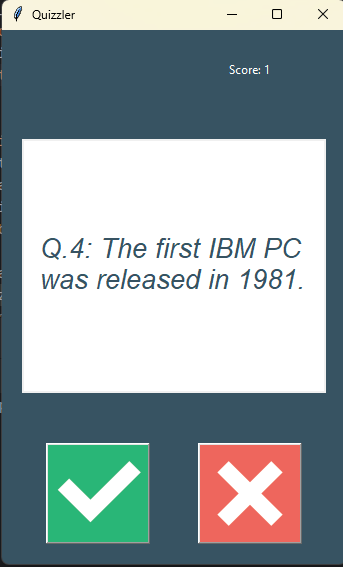

# Python Game Project

This Python projects created using the **Tkinter module**,**Requests module** and **Object-Oriented Programming (OOP)** concepts.  
This Quiz Application that fetches questions dynamically from an external API and presents them in a graphical user interface built using Tkinter. Users can play the quiz by selecting answers using buttons and instantly get feedback on whether their answer is correct or wrong.

---

## Projects Included
- Fetches quiz questions from an external API
- Interactive GUI using Tkinter
- Real-time feedback (Right / Wrong answers)
- Score tracking
- Object-Oriented design
- Secure API key handling using environment variables
- Clean and modular code structure

---

## Technologies Used
- Tkinter (GUI)
- Requests (API calls)
- OOP (Classes & Objects)
- dotenv / os (Environment variables)
---

**Screenshot**

  

