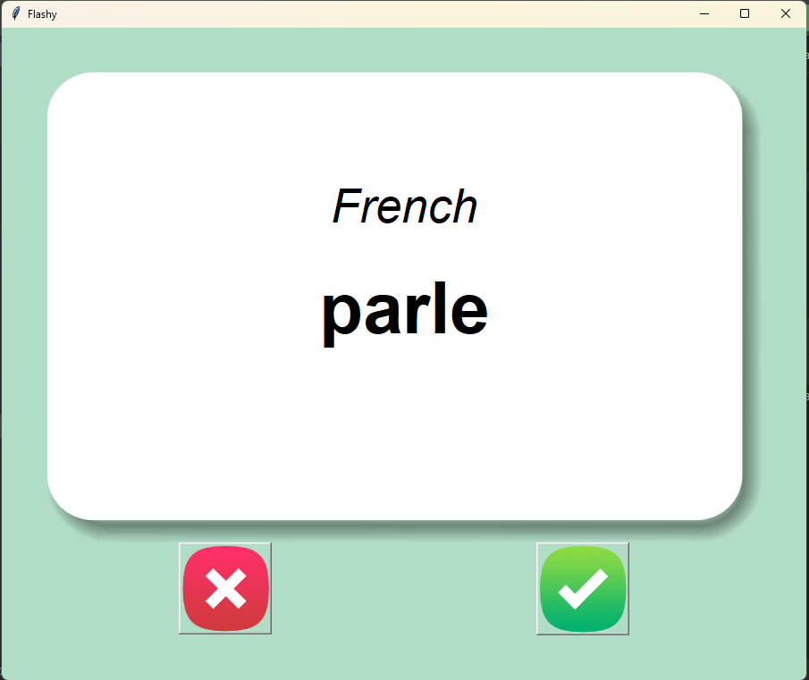
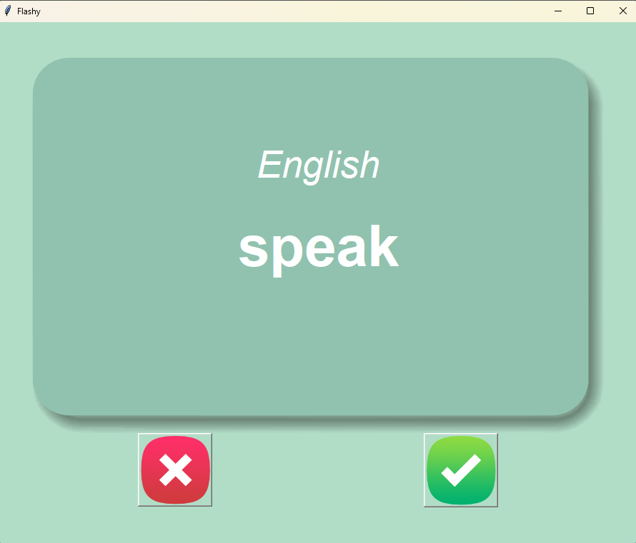

# Flash card Project

This Python projects created using the **Turtle module** and **Object-Oriented Programming (OOP)** concepts.  
These projects are beginner-friendly and focus on logic building and visualization.

---

## Projects Included
- tkinter graphic Designs
- flash card project
- File Handling
- Error Handling
---

**Screenshot**

  
  

